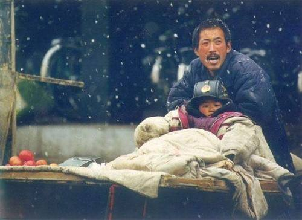

## 怎么变得有思想

阮一峰的博客有一篇《[穷忙的人生][add01]{:target="_blank"}》，富人田北辰体验了两天香港清洁工的生活，他发现：

>“没有学历、技术的人，为了活下去，不是住笼屋就是要工作到半夜，对于他们，最重要事情是下一顿吃什么，怎么会有时间和精力去思考未来怎么发展？来来去去都在死胡同！”

>“只有弱者越弱，越来越惨。”

这就是悲哀的现实，只是因为要“政治正确”，没人愿意轻易说出来而已。

网上有一组这样的照片(据称拍摄者为[严建设][add02]{:target="_blank"})，西安火车站附近，一位搬运工小哥，坐在路边吃蛋糕，吃着吃着却突然红了眼睛，接着低头哭泣。

在看这组照片时，先不管他有什么伤心事，他也有童年，也曾满怀期待，又何曾知晓长大原来需要这样无奈地过活，就像这张照片([安鹤杰][add03]{:target="_blank"}拍摄)中：

小时候有父母遮风挡雪，长大后呢？

从小我们就被教育：要努力，要吃苦，要奋斗，这样才能有所作为，苦尽甘来。

实际上，这都是口号，没有用，而且，能吃苦的人，总有苦可吃。

真正需要的，是学会做事，在做事的过程中，渐渐地开始独立思考，就会变得有思想。

没有学会做事，喊多少口号，喝多少鸡汤，也是枉然。

贾平凹回忆自己的成长经历时曾说：

>别人给你的经验、给你的东西，只是一种启发，具体还得你自己来，就像往上上台阶一样。你站在第一层台阶的时候，根本不了解第三、第四台阶会发生什么，你只能站在第二台阶才能体会到第三台阶，站在第三台阶才能体会到第四台阶。你还在第一台阶上，别人给你说第五台阶的事情，你根本不知道……强大的思想，当你还没有达到同步的时候，就无法进入。

做事最重要的，不是努力、不是吃苦，而是要做完。

做事要努力。努力，不是把同样的或类似的事做上很多遍，而是不断地去尝试新的东西，无论是做事的技巧，还是换一个方向，做完全不同的事。

当发现自己能够非常轻松地完成某件事的时候，应该想一想：是不是该找一点更有难度的事来做了？

发现一件事不知道从何入手，怎么办？

**分解**。

完成一件复杂的事需要技巧，最主要的是分解。

把一件复杂的事层层分解，直到可操作的程度，然后，每次只做一件小事。

这里的“可操作”是指能够列出具体的操作步骤，每一个步骤都有明确的动作，无论是谁，都可以按照操作步骤完成这个分解后的环节。

做事也要心无旁骛，**花费最少**的精力，**快速完成**必要的环节即可。

把一件事做到极致，这是一种偏执，偏执浪费时间、消磨斗志，很可能导致失望和痛苦，最后事情半途而废。乔布斯应该算是一个偏执的人，但第一代iPhone却有很多缺陷，做事的人都知道：**完成比完美更重要**。

关于做事的“事”，做什么、预期要做到什么程度等等，取决于个人的眼界、底蕴、魄力，并没有一定之法。

能够想到这里，已然是一个有思想的人了。

***

[[Episode][episode]]

[add01]:http://www.ruanyifeng.com/survivor/collapse/working-poor.html
[add02]:http://blog.sina.com.cn/aa8807
[add03]:http://www.ruanyifeng.com/blog/2003/12/post_7.html
[episode]:http://about.uuspider.com/2019/06/02/episodeindex.html
[episode]:./2019-06-02-episodeindex.md
